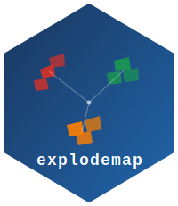

# explodemap 

<!-- badges: start -->

[](https://github.com/PrigasG/explodemap)
[](https://opensource.org/licenses/MIT)

<!-- badges: end -->

`explodemap` provides tools for hierarchical exploded-view cartography
of dense administrative boundary data.

The package generates exploded maps by applying rigid-body translations
to polygon geometries, separating units within and across regions while
preserving each feature's internal geometry exactly. It supports both
the two-level core workflow described in the paper and a three-level
grouped layout extension for larger multi-region or national displays.

The methodology implemented here is described in:

> Arthur, G. *A Hierarchical Vector-Based Framework for Multi-Scale
> Exploded-View Cartography: Centroid-Driven Spatial Displacement for
> Dense Administrative Maps.*

## Installation

``` r
# Install from a local package source directory
devtools::install_local("path/to/explodemap")

# Or install from a tarball
install.packages("explodemap_0.2.0.tar.gz", repos = NULL, type = "source")
```

## What the package does

`explodemap` supports four main workflows:

-   explode any projected sf polygon dataset using a grouping column
-   explode U.S. municipal or county subdivision data directly from
    TIGER/Line via `explode_state()`
-   generate three-level grouped layouts for national or multi-region
    displays using `explode_grouped()`
-   add interactive selected-area focus, labels, and information cards
    using `focus_map()` in htmlwidgets or Shiny

The package also includes analytical parameter derivation, cross-dataset
calibration helpers, optional bounded collision refinement for dense
municipal cores, and optional TopoJSON export for downstream tools such
as Power BI. Shiny workflows are supported with `focusmapOutput()`,
`renderFocusmap()`, stable selection events, information cards, and
`quiet = TRUE` options on geometry builders to keep server logs clean.

For a compact overview, see the
[workflow guide](https://prigasg.github.io/explodemap/articles/workflow-guide.html).

## Quick start

``` r
library(sf)
library(explodemap)

sq <- function(xmin, ymin, size = 1000) {
  st_polygon(list(matrix(
    c(
      xmin, ymin,
      xmin + size, ymin,
      xmin + size, ymin + size,
      xmin, ymin + size,
      xmin, ymin
    ),
    ncol = 2,
    byrow = TRUE
  )))
}

geom <- st_sfc(
  sq(0, 0), sq(3000, 0),      # Region A
  sq(12000, 0), sq(15000, 0), # Region B
  crs = 3857
)

x <- st_sf(
  id = c("a1", "a2", "b1", "b2"),
  region = c("A", "A", "B", "B"),
  geometry = geom
)

result <- explode_sf(x, region_col = "region", plot = FALSE)

print(result)
plot(result, "both")
```

Inside Shiny, keep geometry computation quiet and render the returned
object explicitly:

``` r
result <- explode_sf(x, region_col = "region", plot = FALSE, quiet = TRUE)
focus_map(result, label_col = "id", group_col = "region")
```

## Core entry points

### Explode any projected `sf` object

``` r
result <- explode_sf(my_sf, region_col = "district")
```

### Explode a US state from TIGER/Line

``` r
nj <- explode_state(
  state_fips = "34", crs = 32118,
  region_map = list(
    North   = c("Bergen","Essex","Hudson","Morris","Passaic","Sussex","Union","Warren"),
    Central = c("Hunterdon","Mercer","Middlesex","Monmouth","Somerset"),
    South   = c("Atlantic","Burlington","Camden","Cape May","Cumberland",
                "Gloucester","Ocean","Salem")
  ),
  label = "New Jersey"
)
```

### Explode using an external lookup table

``` r
groups <- read.csv("region_assignments.csv")

result <- explode_sf_with_lookup(
  my_sf, join_col = "GEOID", lookup = groups,
  lookup_key = "geoid", region_col = "region"
)
```

### Filter a visible section before exploding

In Shiny dashboards and drill-down maps, it is often clearer to filter the
section the user selected before calling `explode_sf()`. The selected
subset can then use a more local grouping column while the all-region view
continues to use the broader region groups.

``` r
selected_region <- input$region_focus
if (is.null(selected_region) || !nzchar(selected_region)) {
  selected_region <- "all"
}

visible_sf <- if (identical(selected_region, "all")) {
  nj_counties
} else {
  nj_counties[nj_counties$region == selected_region, ]
}

visible_sf$explode_group <- if (identical(selected_region, "all")) {
  visible_sf$region
} else {
  visible_sf$county_name
}

exploded <- explode_sf(
  visible_sf,
  region_col = "explode_group",
  alpha_r = if (identical(selected_region, "all")) 26000 else 5250,
  alpha_l = if (identical(selected_region, "all")) 12500 else 0,
  refine = TRUE,
  refine_within = "all",
  plot = FALSE,
  quiet = TRUE
)

focus_map(
  exploded,
  label_col = "county_name",
  group_col = "region",
  info_cols = c("population_label", "section_rank", "region")
)
```

This pattern keeps a compact, focused map for section filters while still
using the same `explode_sf()` and `focus_map()` workflow as the full map.
Future package helpers may wrap this filter-first workflow directly.

## Grouped layouts

For larger layouts where region blocks need to be separated at an
additional level, use `explode_grouped()`:

``` r
result <- explode_grouped(
  states_sf, region_col = "hhs_region",
  mode = "auto_collision",
  label = "US by HHS Region"
)
```

Anchor modes:

-   `"auto"`: radial anchor placement
-   `"auto_collision"`: radial placement with iterative collision-aware
    refinement
-   `"manual"`: user-supplied positions

## Working with results

Two-level outputs are returned as exploded_map objects. Grouped layouts
are returned as grouped_exploded_map objects.

Common methods and helpers include:

``` r
print(result)           # Geometry stats and parameters
summary(result)         # Full diagnostic with implied gammas
plot(result)            # Exploded map
plot(result, "both")    # Original + exploded
calibration_row(result) # One-row data.frame for calibration tables
```

Grouped layouts also support:

``` r
plot(result, "all")       # original + local + grouped
```

## Interactive focus maps

`focus_map()` accepts raw `sf`, `exploded_map`, and
`grouped_exploded_map` objects. For exploded objects it automatically
uses the WGS84 displaced geometry, so the same result can be plotted,
exported, or rendered as an interactive focus map.

``` r
focus_map(
  result,
  label_col = "NAME",
  id_col = "GEOID",
  group_col = "region",
  group_palette = c(North = "#4C78A8", Central = "#F58518", South = "#54A24B"),
  info_cols = c("population", "median_income"),
  info_card_scale = 0.95
)
```

In Shiny, use the exported widget helpers. The widget emits a selection
value at `input$<outputId>_selected` containing the selected feature ID,
label, group, and properties.

``` r
ui <- fluidPage(
  focusmapOutput("map", height = "650px"),
  verbatimTextOutput("selected")
)

server <- function(input, output, session) {
  output$map <- renderFocusmap({
    focus_map(result, label_col = "NAME", id_col = "GEOID")
  })

  output$selected <- renderPrint(input$map_selected)
}
```

Use `group_palette` when a dashboard legend or data category already has
meaningful colours. Unmatched groups fall back to the built-in palette, so
apps can provide partial palettes while still rendering all groups.

For drill-down dashboards, use `explode_section()` to explode only the
selected section while keeping the rest of the geography as muted context:

``` r
focused <- explode_section(
  municipalities,
  section_col = "nj_region",
  section = "South",
  region_col = "county_name",
  alpha_r = 900,
  alpha_l = 600,
  plot = FALSE,
  quiet = TRUE
)

focus_map(
  focused,
  label_col = "NAME",
  id_col = "GEOID",
  context_col = ".explodemap_role",
  context_mode = "fade",
  context_opacity = 0.16
)
```

This pattern supports the "click a region, explode that region, keep the
state as context" workflow without forcing app code to manually stitch
focus and background geometries back together.

For dense municipal maps, tiny polygons can opt into a closer focus without
changing the default county-scale behavior:

``` r
focus_map(
  focused_municipalities,
  label_col = "NAME",
  id_col = "GEOID",
  min_focus_width = 115,
  min_focus_height = 88,
  tiny_feature_threshold = 52,
  tiny_feature_boost = 1.45,
  origin_context = "inset",
  origin_context_position = "bottom-left",
  focus_context_opacity = 0.14,
  show_drag_zoom = TRUE
)
```

## Mathematical guarantees

For the two-level core workflow, the package implements the analytical
parameter formulas described in the paper:

-   alpha_r = gamma_r \* w_bar / (2 \* sin(pi / n_regions))
-   alpha_l = gamma_l \* 2 \* R_local / sqrt(n_bar)

Default coefficients are:

-   gamma_r = 3.0
-   gamma_l = 1.136
-   p = 1.25

All geometric quantities other than the gamma coefficients are computed
from the dataset itself. The gamma coefficients are dimensionless
legibility constants calibrated on New Jersey and validated across
multiple U.S. states and a Canada example.

For the two-level core, the paper states three key properties:

| Property | Guarantee | Scope |
|--------------------------|----------------------------|------------------|
| **Proposition 1** | Internal geometry preserved exactly (rigid translation) | Per feature |
| **Proposition 2** | Radial ordering within regions preserved | Per region |
| **Proposition 3** | Max displacement bounded by α_r + α_l | Global |

The grouped three-level extension preserves structural grouping and
directional correspondence at higher levels rather than topological
coverage.

## Parameters

Two-level parameters derived automatically via Analytical Results 1–2:

-   `alpha_r = gamma_r * w_bar / (2 * sin(pi / n_regions))` — regional
    separation
-   `alpha_l = gamma_l * 2 * R_local / sqrt(n_bar)` — local expansion

Defaults: `gamma_r = 3.0`, `gamma_l = 1.136`, `p = 1.25`

All quantities except `gamma_r` and `gamma_l` are computed from the
dataset geometry. The gamma coefficients are dimensionless legibility
constants calibrated from the paper examples and intended as practical
defaults. You can override `alpha_r` and `alpha_l` independently when a
particular map needs more or less visual separation.

For very dense municipal cores, you can add a bounded collision-refinement
pass after the analytical displacement:

``` r
refined <- explode_sf(
  my_sf,
  region_col = "district",
  refine = TRUE,
  refine_min_gap = 250,
  refine_max_shift = 150
)
```

This optional layer nudges close same-region neighbors apart while capping
the extra correction per feature. Use `refine_within = "all"` if the
remaining crowding crosses region boundaries.

For app code, all main geometry workflows accept `quiet = TRUE`:

``` r
explode_sf(my_sf, "district", plot = FALSE, quiet = TRUE)
explode_sf_with_lookup(my_sf, "GEOID", lookup, plot = FALSE, quiet = TRUE)
explode_state("34", crs = 32118, region_map = regions, plot = FALSE, quiet = TRUE)
explode_grouped(my_sf, "district", mode = "auto_collision", plot = FALSE, quiet = TRUE)
layout_regions(my_sf, "district", mode = "auto_collision", quiet = TRUE)
```

## Examples

Small examples that run without external downloads are installed with
the package:

``` r
source(system.file("examples/basic_explode_sf.R", package = "explodemap"))
source(system.file("examples/collision_refinement.R", package = "explodemap"))
source(system.file("examples/lookup_workflow.R", package = "explodemap"))
source(system.file("examples/manual_parameter_tuning.R", package = "explodemap"))
```

Paper-scale examples that download public boundary data are also
available:

``` r
source(system.file("examples/run_calibration.R", package = "explodemap"))
source(system.file("examples/run_canada.R", package = "explodemap"))
source(system.file("examples/run_hhs.R", package = "explodemap"))
```

Interactive focus-map examples are installed as app scripts:

``` r
shiny::runApp(system.file("examples/focusmap_munis_app.R", package = "explodemap"))
shiny::runApp(system.file("examples/focusmap_counties_app.R", package = "explodemap"))
```

## Export

`explodemap` can optionally export `TopoJSON` through the external
`mapshaper` command-line tool:

``` r
export_topojson(result, "exploded.topojson")
```

This is useful for downstream tools such as Power BI. To use it, install
mapshaper separately:

``` bash
npm install -g mapshaper
```

## Vignettes

``` r
vignette("getting-started", package = "explodemap")
vignette("grouped-layouts", package = "explodemap")
```

## Citation

If you use this package in academic work, please cite:

> Arthur, G. (2026). A hierarchical vector-based framework for
> multi-scale exploded-view cartography. *Working paper*.
