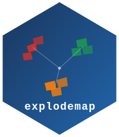

# explodemap 

[](https://github.com/PrigasG/explodemap) [](https://opensource.org/licenses/MIT) [](https://huggingface.co/spaces/Prigas89/explodemap-gallery) [](https://huggingface.co/spaces/Prigas89/spatial-pipeline-studio)

`explodemap` makes exploded-view maps from polygon data. It separates crowded regions for display while keeping every polygon's shape intact.

Use it when you want to:

- separate dense counties, municipalities, districts, or service areas
- build larger grouped layouts such as national region maps
- inspect one area interactively with `focus_map()`
- hand a computed layout to `dragmapr` for manual composition

## Install

``` r
install.packages("explodemap")

# Development version
# install.packages("pak")
# pak::pak("PrigasG/explodemap")
```

## Try It

- Live gallery: <https://huggingface.co/spaces/Prigas89/explodemap-gallery>
- Shared Pipeline Studio: <https://huggingface.co/spaces/Prigas89/spatial-pipeline-studio>
- Package site: <https://prigasg.github.io/explodemap/>
- Cross-package roadmap: [ROADMAP.md](ROADMAP.md)
- Pipeline Studio:

``` r
shiny::runApp(system.file("shiny/pipeline-studio", package = "explodemap"))
```

Pipeline Studio is the bridge app for `explodemap` and `dragmapr`: compute a layout, refine it by dragging, apply the edits, and export the final map.

## Quick Start

``` r
library(sf)
library(explodemap)

sq <- function(x, y, size = 1000) {
  st_polygon(list(rbind(
    c(x, y), c(x + size, y), c(x + size, y + size),
    c(x, y + size), c(x, y)
  )))
}

x <- st_sf(
  id = c("a1", "a2", "b1", "b2"),
  region = c("A", "A", "B", "B"),
  geometry = st_sfc(
    sq(0, 0), sq(3000, 0),
    sq(12000, 0), sq(15000, 0),
    crs = 3857
  )
)

layout <- explode_sf(x, region_col = "region", plot = FALSE)

plot(layout, "both")
```

## Main Workflows

### Explode Any Projected `sf`

``` r
layout <- explode_sf(my_sf, region_col = "district", plot = FALSE)
```

Input should be polygon or multipolygon `sf` data in a projected CRS.

### Explode A US State

``` r
nj <- explode_state(
  state_fips = "34",
  crs = 32111,
  level = "cousub",
  region_map = list(
    North = c("Bergen", "Essex", "Hudson", "Morris"),
    Central = c("Hunterdon", "Mercer", "Middlesex"),
    South = c("Atlantic", "Camden", "Cape May")
  ),
  plot = FALSE
)
```

Use `level = "county"` for county maps, or `level = "cousub"` for municipal and county-subdivision maps.

### Build A Grouped Layout

``` r
grouped <- explode_grouped(
  my_sf,
  region_col = "region",
  mode = "auto_collision",
  plot = FALSE
)
```

Grouped layouts are useful for national or multi-region maps where entire region blocks need space between them.

### Inspect The Result Interactively

``` r
focus_map(
  grouped,
  label_col = "name",
  group_col = "region",
  group_palette = group_palette(grouped$sf_grouped$region),
  show_group_labels = TRUE
)
```

In Shiny:

``` r
ui <- fluidPage(focusmapOutput("map", height = "650px"))

server <- function(input, output, session) {
  output$map <- renderFocusmap({
    focus_map(grouped, label_col = "name", group_col = "region")
  })
}
```

## Prepare And Check Data

Release A adds small helpers that are useful in scripts, apps, and tests:

``` r
check <- validate_explodemap_input(
  my_sf,
  group_col = "region",
  id_col = "geoid",
  label_col = "name"
)

prepared <- prepare_explodemap_input(
  my_sf,
  id_col = "geoid",
  label_col = "name",
  group_col = "region",
  target_crs = 5070,
  target_vertices = 350000
)

layout <- explode_grouped(prepared$data, region_col = "region")
```

If the source file does not have a usable ID column, `prepare_explodemap_input()` creates deterministic `unit_id` values from the geometry and labels. Feature-level handoffs then use those IDs instead of row numbers:

``` r
prepared <- prepare_explodemap_input(
  my_sf,
  label_col = "name",
  group_col = "region"
)

layout <- explode_grouped(prepared$data, region_col = "region", plot = FALSE)
movement <- transition_data(layout, level = "feature", id_col = "unit_id")
```

Other app-friendly helpers:

``` r
count_geometry_vertices(my_sf)
simplify_to_vertex_budget(my_sf, target_vertices = 350000)
assign_spatial_groups(my_sf, method = "clusters", groups = 6)
group_palette(my_sf$region)
explodemap_fingerprint(my_sf, id_col = "geoid", group_col = "region")
```

## Improve A Layout

Automatic layout is collision-aware, but cartographic composition often still needs judgment. Use diagnostics and bounded search before manual editing:

``` r
report <- diagnose_layout(grouped, label_col = "name")
plot(report)

better <- optimize_grouped_layout(
  my_sf,
  region_col = "region",
  label_col = "name"
)
```

Then hand the layout to `dragmapr`:

``` r
library(dragmapr)

state <- as_dragmapr_state(better)
state$region_col
dragmapr_edit(better, state = state)
```

Render the same edited state in either package:

``` r
focus_map(better, state = state)

render_dragged_map(
  better$sf_grouped,
  region_col = "region",
  state = state
)
```

## Common Helpers

``` r
print(layout)
summary(layout)
plot(layout)
plot(layout, "both")
calibration_row(layout)
```

Export TopoJSON when `mapshaper` is installed:

``` r
export_topojson(layout, "exploded.topojson")
```

## Learn More

``` r
vignette("getting-started", package = "explodemap")
vignette("workflow-guide", package = "explodemap")
vignette("grouped-layouts", package = "explodemap")
vignette("state-first-composition", package = "explodemap")
```

The method is described in:

> Arthur, G. (2026). *A Hierarchical Vector-Based Framework for Multi-Scale Exploded-View Cartography: Centroid-Driven Spatial Displacement for Dense Administrative Maps.*
