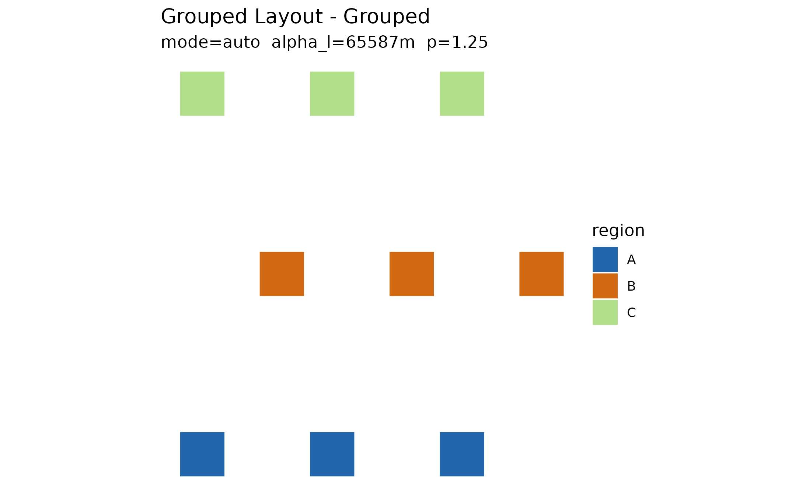

# Explode, edit, compare, render

The full `explodemap` loop is **explode, measure, edit, compare,
render**:

    explode_grouped()  ->  displacement_magnitudes()  ->  d_edit()  ->  compare_layouts()  ->  as_sf()
       (compute)              (measure)                   (compose)        (compare)             (export)

This vignette walks the whole loop on a small synthetic grid. The
editorial pass is shown two ways: interactively in the dragmapr editor,
and as a scripted nudge in pure R (handy for reproducible tweaks and for
CI, where no browser is available).

## 1. Explode

``` r

library(explodemap)

unit_square <- function(x0, y0, size = 40000) {
  sf::st_polygon(list(rbind(
    c(x0, y0), c(x0 + size, y0), c(x0 + size, y0 + size),
    c(x0, y0 + size), c(x0, y0)
  )))
}

grid <- expand.grid(col = 0:2, row = 0:2)
regions <- sf::st_sf(
  region = rep(c("A", "B", "C"), each = 3),
  unit   = sprintf("u%02d", seq_len(9)),
  geometry = sf::st_sfc(
    lapply(seq_len(9), function(i) unit_square(grid$col[i] * 50000, grid$row[i] * 50000)),
    crs = 3857
  )
)

layout <- explode_grouped(regions, region_col = "region", plot = FALSE, quiet = TRUE)
plot(layout)
```



## 2. Measure the layout

Before editing, quantify what the algorithm did.
[`displacement_magnitudes()`](https://prigasg.github.io/explodemap/reference/displacement_magnitudes.md)
gives the per-feature movement in metres:

``` r

dm <- displacement_magnitudes(layout)
tapply(dm$distance, as_sf(layout)$region, function(d) round(c(mean = mean(d), max = max(d))))
#> $A
#>   mean    max 
#> 122766 128752 
#> 
#> $B
#>   mean    max 
#>  70796 136383 
#> 
#> $C
#>   mean    max 
#> 122766 128752
```

## 3. Hand off to dragmapr

[`as_dragmapr_state()`](https://prigasg.github.io/explodemap/reference/as_dragmapr_state.md)
converts the computed anchors into a reusable `dragmapr_state` — the
composition object the editor and the renderers share:

``` r

state <- as_dragmapr_state(layout)
state
#> $level
#> [1] "region"
#> 
#> $region_offsets
#>   region dx_m dy_m
#> 1      A    0    0
#> 2      B    0    0
#> 3      C    0    0
#> 
#> $label_offsets
#> [1] label_id region   dx_m     dy_m    
#> <0 rows> (or 0-length row.names)
#> 
#> $expanded_groups
#> character(0)
#> 
#> $view
#> NULL
#> 
#> $version
#> [1] 0
#> 
#> $crs
#> [1] 3857
#> 
#> $geometry_id
#> [1] "Grouped Layout"
#> 
#> $selected_feature
#> NULL
#> 
#> $styles
#> [1] region        fill          stroke        stroke_width  opacity      
#> [6] label_visible highlight    
#> <0 rows> (or 0-length row.names)
#> 
#> $region_col
#> [1] "region"
#> 
#> $label_id_col
#> [1] "label_id"
#> 
#> $binding
#> $binding$region_col
#> [1] "region"
#> 
#> $binding$label_id_col
#> [1] "label_id"
#> 
#> 
#> $schema_version
#> [1] "1.2.0"
#> 
#> $package_version
#> [1] "0.3.1"
#> 
#> attr(,"class")
#> [1] "dragmapr_state"
```

## 4. Edit

Open the editor seeded with the computed layout. In Shiny, capture each
edit back into a state with
[`dragmapr::d_widget_state()`](https://prigasg.github.io/dragmapr/reference/d_widget_state.html):

``` r

dragmapr::d_edit(layout, state = state)
```

For a reproducible tweak — or anywhere without a browser — apply the
same kind of edit as data. Here region “B” is nudged 50 km east:

``` r

nudge <- data.frame(
  region = "B",
  dx_m = 50000,
  dy_m = 0
)
edited <- update_exploded_layout(layout, nudge, update_plots = FALSE)
```

## 5. Compare before and after

[`compare_layouts()`](https://prigasg.github.io/explodemap/reference/compare_layouts.md)
summarises how the edit changed per-feature displacement:

``` r

cmp <- compare_layouts(layout, edited)
cmp$summary
#>   layout     total     mean      max
#> 1 before  948985.1 105442.8 136383.2
#> 2  after 1098985.1 122109.5 186383.2
head(cmp$per_feature)
#>   distance_before distance_after delta
#> 1      128751.916      128751.92     0
#> 2      110794.415      110794.42     0
#> 3      128751.916      128751.92     0
#> 4        5209.225       55209.22 50000
#> 5       70796.215      120796.22 50000
#> 6      136383.206      186383.21 50000
```

## 6. Render and export

Render the edited composition statically (writes a PNG next to this
document’s working directory when run interactively):

``` r

dragmapr::render_dragged_map(
  as_sf(edited, which = "grouped"),
  region_col = "region",
  state = state,
  file = "edited.png"
)
```

And convert the final layout back to plain `sf` for downstream GIS work
— file export, spatial joins, or further `sf` analysis:

``` r

final_sf <- as_sf(edited)
sf::st_write(final_sf, file.path(tempdir(), "edited.gpkg"), quiet = TRUE)
list.files(tempdir(), pattern = "edited")
#> [1] "edited.gpkg"
```

The loop closes: `final_sf` is an ordinary `sf` data frame, so anything
that reads simple features can pick up where the editor left off.
