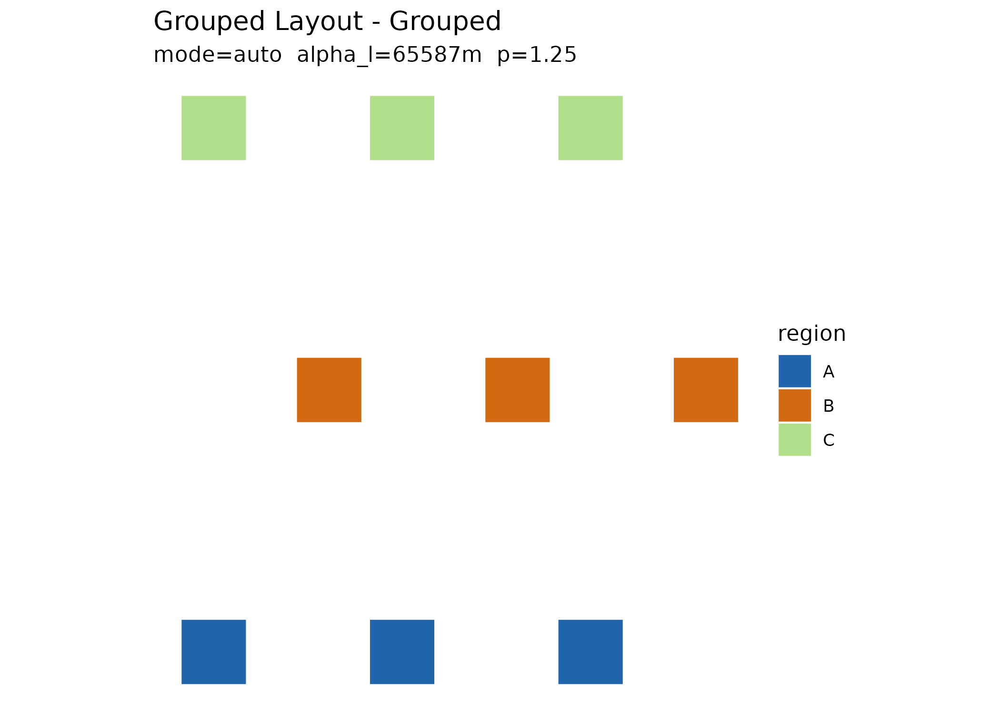

# State-first composition with dragmapr

`explodemap` computes the *geometry* of an exploded layout. Manual
composition – nudging regions and labels until the map reads well –
belongs to the [dragmapr](https://prigasg.github.io/dragmapr/) editor.
The bridge between them is a single, reusable **composition object**: a
`dragmapr_state`.

The workflow is **compute once, then compose and render from the
state**:

    explode_grouped()  ->  as_dragmapr_state()  ->  dragmapr_edit()  ->  focus_map(state = )
       (geometry)            (handoff)                (compose)            render_dragged_map(state = )

## 1. Compute the layout

``` r

library(explodemap)

# A few regions, each with several units.
unit_square <- function(x0, y0, size = 40000) {
  sf::st_polygon(list(rbind(
    c(x0, y0), c(x0 + size, y0), c(x0 + size, y0 + size),
    c(x0, y0 + size), c(x0, y0)
  )))
}

grid <- expand.grid(col = 0:2, row = 0:2)
regions <- sf::st_sf(
  region = rep(c("A", "B", "C"), each = 3),
  unit   = sprintf("u%02d", seq_len(9)),
  geometry = sf::st_sfc(
    lapply(seq_len(9), function(i) unit_square(grid$col[i] * 50000, grid$row[i] * 50000)),
    crs = 3857
  )
)

layout <- explode_grouped(regions, region_col = "region")
#> Level 1: Applying local explosion (alpha_l = 65587 m)...
#> Level 2: Computing anchor positions (mode = auto)...
#> Applying anchor displacement...
```



``` r

plot(layout)
```


## 2. Hand the layout over as a state

[`as_dragmapr_state()`](https://prigasg.github.io/explodemap/reference/as_dragmapr_state.md)
is the preferred handoff. It converts the exploded anchors into metre
deltas and records the projected CRS plus a `geometry_id`, so the result
is a durable, reproducible composition:

``` r

state <- as_dragmapr_state(layout)
state
#> $level
#> [1] "region"
#> 
#> $region_offsets
#>   region dx_m dy_m
#> 1      A    0    0
#> 2      B    0    0
#> 3      C    0    0
#> 
#> $label_offsets
#> [1] label_id region   dx_m     dy_m    
#> <0 rows> (or 0-length row.names)
#> 
#> $expanded_groups
#> character(0)
#> 
#> $view
#> NULL
#> 
#> $version
#> [1] 0
#> 
#> $crs
#> [1] 3857
#> 
#> $geometry_id
#> [1] "Grouped Layout"
#> 
#> $selected_feature
#> NULL
#> 
#> $region_col
#> [1] "region"
#> 
#> $label_id_col
#> [1] "label_id"
#> 
#> $binding
#> $binding$region_col
#> [1] "region"
#> 
#> $binding$label_id_col
#> [1] "label_id"
#> 
#> 
#> $schema_version
#> [1] "1.1.0"
#> 
#> $package_version
#> [1] "0.3.1"
#> 
#> attr(,"class")
#> [1] "dragmapr_state"
```

> The older
> [`as_dragmapr()`](https://prigasg.github.io/explodemap/reference/as_dragmapr.md)
> returns a raw `dragmapr_layout` (geometry plus offset tables). It
> remains supported as a low-level escape hatch, but
> [`as_dragmapr_state()`](https://prigasg.github.io/explodemap/reference/as_dragmapr_state.md)
> is the recommended entry point.

## 3. Compose

Open the dragmapr editor seeded with the state. In Shiny, capture each
edit back into a state with
[`dragmapr::dragmapr_widget_state()`](https://prigasg.github.io/dragmapr/reference/dragmapr_widget_state.html):

``` r

dragmapr::dragmapr_edit(layout, state = state)
```

## 4. Render the composed state

Every downstream renderer accepts the state via `state =`. The
interactive focus map can even reopen on a saved selection with
`restore_selection = TRUE`:

``` r

state$selected_feature <- "B"
focus_map(layout, state = state, group_col = "region", restore_selection = TRUE)
```

And the static renderer reproduces the composition from geometry plus
state, with no recomputation:

``` r

dragmapr::render_dragged_map(
  layout$sf_grouped,
  region_col = "region",
  state = state,
  file = "composed.png"
)
```

The state also flows through
[`update_exploded_layout()`](https://prigasg.github.io/explodemap/reference/update_exploded_layout.md),
so an edited composition can be folded back onto the grouped layout
object itself.

For a complete runnable script, see
`system.file("examples/state_first_workflow.R", package = "explodemap")`.

For a fuller cross-package example that includes layout diagnostics,
label-aware parameter search, a simulated editorial pass, JSON state
persistence,
[`focus_map()`](https://prigasg.github.io/explodemap/reference/focus_map.md),
and
[`dragmapr::render_dragged_map()`](https://prigasg.github.io/dragmapr/reference/render_dragged_map.html),
run:

``` r

source(system.file(
  "examples/explodemap_dragmapr_pipeline.R",
  package = "explodemap"
))
```
