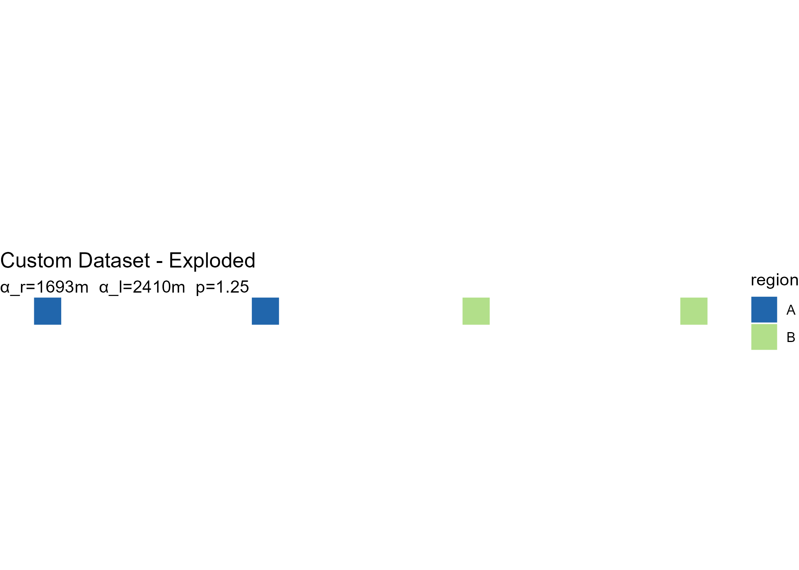

# Getting started with explodemap

## Overview

`explodemap` generates hierarchical exploded-view maps for dense
administrative boundary data. It applies rigid-body translations to
polygon geometries so that features are visually separated while each
feature’s internal geometry is preserved exactly.

The basic two-level workflow is:

1.  Group units into regions using a column in your data.
2.  Displace units within and across those regions using a
    centroid-driven vector field with analytically derived parameters.

For the two-level core described in the paper, the package is designed
to satisfy three key properties:

- **Proposition 1:** each polygon’s shape, area, perimeter, and topology
  are preserved exactly.
- **Proposition 2:** the radial ordering of units within each region is
  preserved.
- **Proposition 3:** no unit is displaced by more than
  `alpha_r + alpha_l` metres.

## Input requirements

`explodemap` expects an `sf` object with:

- Polygon or multipolygon geometries
- A grouping column identifying the parent region for each unit
- A **projected** CRS with linear metre units

Geographic coordinates such as EPSG:4326 (longitude/latitude) must be
transformed before use. For U.S. work, a state plane, UTM, or
Albers-type projected CRS is usually appropriate.

``` r

library(sf)
#> Warning: package 'sf' was built under R version 4.5.2
#> Linking to GEOS 3.13.1, GDAL 3.11.4, PROJ 9.7.0; sf_use_s2() is TRUE
library(explodemap)
```

## A minimal example

We create a small synthetic dataset with four square polygons in two
regions.

``` r

sq <- function(xmin, ymin, size = 1000) {
  st_polygon(list(matrix(
    c(xmin, ymin,
      xmin + size, ymin,
      xmin + size, ymin + size,
      xmin, ymin + size,
      xmin, ymin),
    ncol = 2,
    byrow = TRUE
  )))
}

geom <- st_sfc(
  sq(0, 0), sq(3000, 0),       # Region A
  sq(12000, 0), sq(15000, 0),  # Region B
  crs = 3857
)

x <- st_sf(
  id     = c("a1", "a2", "b1", "b2"),
  region = c("A", "A", "B", "B"),
  geometry = geom
)

x
#> Simple feature collection with 4 features and 2 fields
#> Geometry type: POLYGON
#> Dimension:     XY
#> Bounding box:  xmin: 0 ymin: 0 xmax: 16000 ymax: 1000
#> Projected CRS: WGS 84 / Pseudo-Mercator
#>   id region                       geometry
#> 1 a1      A POLYGON ((0 0, 1000 0, 1000...
#> 2 a2      A POLYGON ((3000 0, 4000 0, 4...
#> 3 b1      B POLYGON ((12000 0, 13000 0,...
#> 4 b2      B POLYGON ((15000 0, 16000 0,...
```

## Running the explosion

The simplest entry point is
[`explode_sf()`](https://prigasg.github.io/explodemap/reference/explode_sf.md).
Pass your sf object and the name of the grouping column:

``` r

result <- explode_sf(x, region_col = "region", plot = FALSE)
```

The returned object is an S3 object of class `exploded_map`:

``` r

class(result)
#> [1] "exploded_map" "list"
names(result)
#>  [1] "sf_orig"         "sf_exp"          "sf_exp_wgs"      "stats"          
#>  [5] "params"          "gamma_r_implied" "gamma_l_implied" "plots"          
#>  [9] "refinement"      "diagnostics"
```

It contains the original and exploded geometries, a WGS84 export-ready
version, derived statistics and parameters, plots, and diagnostics.

## Diagnostics

[`print()`](https://rdrr.io/r/base/print.html) shows geometry statistics
and derived parameters:

``` r

print(result)
#> 
#> -- Custom Dataset ----------------------------------------
#>   n units   :  4 
#>   n regions :  2 
#>   w_bar     :  1.1 km 
#>   R_local   :  1.5 km 
#>   n_bar     :  2 
#>   R_local/w :  1.33 
#>   alpha_r   :  1.7 km 
#>   alpha_l   :  2.4 km 
#>   p         :  1.25 
#>   max ||t|| :  4.1 km   (Proposition 3 bound)
```

[`summary()`](https://rdrr.io/r/base/summary.html) adds implied gamma
coefficients that are useful for calibration work:

``` r

summary(result)
#> 
#> Exploded Map Summary
#> ====================
#> Dataset:      Custom Dataset 
#> Units:        4 
#> Regions:      2 
#> Grouped by:   region 
#> 
#> Geometry Statistics
#>   Characteristic diameter (w_bar):  1.1 km 
#>   Regional radius (R_local):        1.5 km 
#>   Median units/region (n_bar):      2 
#>   Tightness ratio (R_local/w_bar):  1.33 
#> 
#> Parameters
#>   alpha_r:  1.7 km   (regional separation)
#>   alpha_l:  2.4 km   (local expansion)
#>   p:        1.25 
#> 
#> Implied Gamma Coefficients
#>   gamma_r:  3 
#>   gamma_l:  1.136
```

## Plotting

``` r

plot(result)
```



You can also view both original and exploded layouts side by side:

``` r

plot(result, "both")
```


## Calibration output

[`calibration_row()`](https://prigasg.github.io/explodemap/reference/calibration_row.md)
returns a one-row data frame suitable for combining across datasets when
building a cross-dataset calibration table:

``` r

calibration_row(result)
#>            label n_units n_regions w_bar_km R_local_km ratio alpha_r alpha_l
#> 1 Custom Dataset       4         2     1.13        1.5  1.33    1693    2410
#>   gamma_r_implied gamma_l_implied
#> 1               3           1.136
```

## Manual parameter overrides

By default, `explodemap` derives displacement parameters analytically
from dataset geometry using the paper’s two closed-form results. You can
also supply parameters directly. Overrides may be supplied
independently, so you can tune regional separation without changing
local expansion, or vice versa:

``` r

manual <- explode_sf(
  x,
  region_col = "region",
  alpha_r = 100,
  alpha_l = 200,
  plot = FALSE
)
#> Using manual alpha_r = 100 m
#> Using manual alpha_l = 200 m

manual$params
#> $alpha_r
#> [1] 100
#> 
#> $alpha_l
#> [1] 200
#> 
#> $p
#> [1] 1.25
#> 
#> $gamma_r
#> [1] NA
#> 
#> $gamma_l
#> [1] NA
#> 
#> $refine
#> [1] FALSE
```

``` r

more_region_gap <- explode_sf(
  x,
  region_col = "region",
  alpha_r = result$params$alpha_r * 1.5,
  plot = FALSE
)
#> Using manual alpha_r = 2538.8531259649 m

more_region_gap$params
#> $alpha_r
#> [1] 2538.853
#> 
#> $alpha_l
#> [1] 2409.82
#> 
#> $p
#> [1] 1.25
#> 
#> $gamma_r
#> [1] NA
#> 
#> $gamma_l
#> [1] 1.136
#> 
#> $refine
#> [1] FALSE
```

## Optional collision refinement

The two-level algorithm is the clean paper model. For dense municipal
cores, you can add a bounded refinement pass that nudges close
same-region neighbors apart after the analytical displacement:

``` r

refined <- explode_sf(
  x,
  region_col = "region",
  refine = TRUE,
  refine_min_gap = 0.15,
  refine_max_shift = 0.10,
  plot = FALSE
)
#> Collision refinement: corrected 0 pair-visits; max shift = 0.0 m.

refined$refinement
#> $enabled
#> [1] TRUE
#> 
#> $min_gap
#> [1] 0.15
#> 
#> $max_shift
#> [1] 0.1
#> 
#> $max_iter
#> [1] 20
#> 
#> $step
#> [1] 0.5
#> 
#> $within
#> [1] "region"
#> 
#> $iterations
#> [1] 1
#> 
#> $corrected_pairs
#> [1] 0
#> 
#> $active_pairs_last
#> [1] 0
#> 
#> $max_shift_observed
#> [1] 0
```

`refine_max_shift` caps the extra correction per feature, so the
refinement remains a small display adjustment rather than a replacement
for the displacement model. Use `refine_within = "all"` when the
remaining crowding crosses region boundaries.

## Centroid options

For irregular or multipart polygons, `"point_on_surface"` may be
preferable to the default geometric centroid:

``` r

pos <- explode_sf(
  x,
  region_col = "region",
  centroid_fun = "point_on_surface",
  plot = FALSE
)
```

## Using TIGER/Line data for U.S. states

[`explode_state()`](https://prigasg.github.io/explodemap/reference/explode_state.md)
downloads U.S. Census TIGER/Line boundaries automatically and groups
municipalities by a county-to-region mapping:

``` r

nj <- explode_state(
  state_fips = "34", crs = 32118,
  region_map = list(
    North   = c("Bergen", "Essex", "Hudson", "Morris",
                "Passaic", "Sussex", "Union", "Warren"),
    Central = c("Hunterdon", "Mercer", "Middlesex",
                "Monmouth", "Somerset"),
    South   = c("Atlantic", "Burlington", "Camden", "Cape May",
                "Cumberland", "Gloucester", "Ocean", "Salem")
  ),
  label = "New Jersey"
)
```

Downloaded data is cached locally so subsequent runs are faster.

## Using a lookup table

[`explode_sf_with_lookup()`](https://prigasg.github.io/explodemap/reference/explode_sf_with_lookup.md)
joins an external lookup table to your sf object before exploding:

``` r

groups <- read.csv("region_assignments.csv")

result <- explode_sf_with_lookup(
  my_sf,
  join_col   = "GEOID",
  lookup     = groups,
  lookup_key = "geoid",
  region_col = "region"
)
```

Unmatched units are labelled `"Other"`. This is useful when a lookup
table is incomplete. You can include or exclude those units using
`allow_other`.

## Export

The `export` parameter supports three modes:

- `NULL` (default): no export
- `TRUE`: auto-named GeoJSON file
- A file path string: explicit output location

``` r

result <- explode_sf(
  my_sf,
  region_col = "region",
  export = "output.geojson"
)
```

## Notes

- Always use a projected CRS before running the algorithm.
- The two-level core preserves each feature’s internal geometry exactly
  through rigid-body translation.
- Parameter derivation is deterministic and reproducible: the same
  dataset and gamma coefficients always produce the same output.

## Next steps

See
[`vignette("grouped-layouts")`](https://prigasg.github.io/explodemap/articles/grouped-layouts.md)
for the three-level extension using
[`explode_grouped()`](https://prigasg.github.io/explodemap/reference/explode_grouped.md),
which adds region-block anchor placement for larger multi-region or
national layouts.
