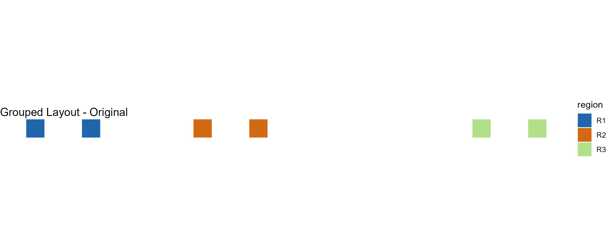
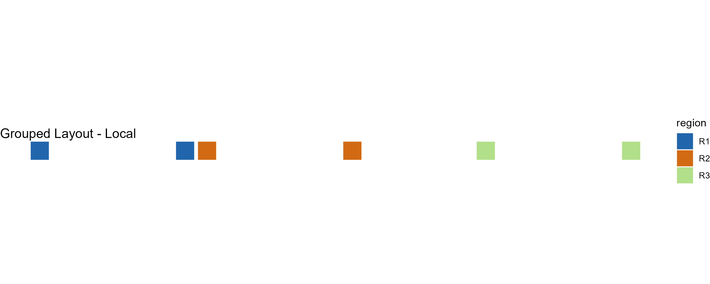
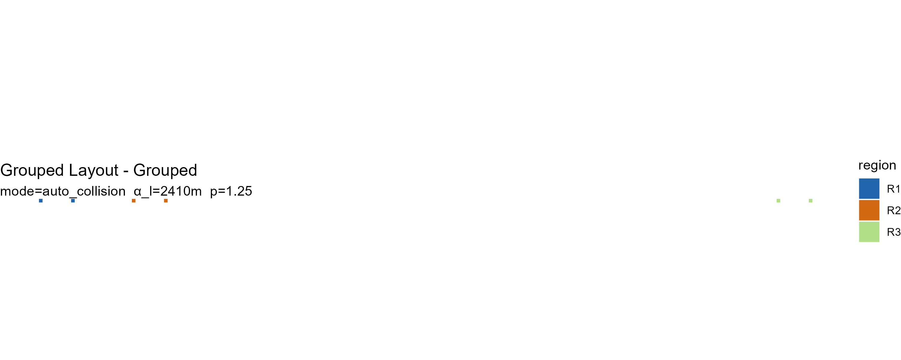
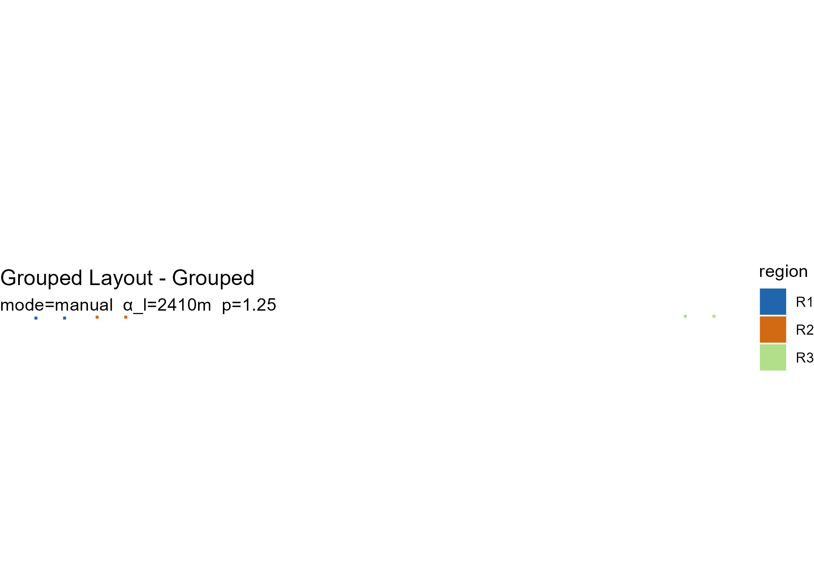

# Grouped layouts and anchor placement

## Overview

[`explode_grouped()`](https://prigasg.github.io/explodemap/reference/explode_grouped.md)
extends the core two-level exploded-map workflow with a three-level
hierarchy for multi-region or national-scale layouts.

This grouped extension is most useful when a standard two-level
explosion still leaves region blocks visually crowded or difficult to
compare across a larger spatial extent.

The three levels are:

1.  **Level 1 — Local explosion.** Units within each parent region are
    displaced using the centroid-driven field from the core algorithm.
    The geometric guarantees of Propositions 1–3 apply at this level.

2.  **Level 2 — Radial anchor placement.** Parent region centroids are
    displaced radially outward from the national centroid to generate
    initial anchor positions for each region block.

3.  **Level 3 — Collision-aware refinement** (optional). Overlapping
    anchors are iteratively repelled while a spring term maintains
    proximity to the original radial targets.

Levels 2 and 3 preserve structural grouping and directional
correspondence rather than topological coverage. The formal geometric
guarantees of Propositions 1–3 apply strictly at Level 1.

``` r

library(sf)
#> Warning: package 'sf' was built under R version 4.5.2
#> Linking to GEOS 3.13.1, GDAL 3.11.4, PROJ 9.7.0; sf_use_s2() is TRUE
library(explodemap)
```

## A synthetic grouped example

We create a small dataset with six units in three regions, spread across
a wider spatial extent than the two-region example in
[`vignette("getting-started")`](https://prigasg.github.io/explodemap/articles/getting-started.md).

``` r

sq <- function(xmin, ymin, size = 1000) {
  st_polygon(list(matrix(
    c(xmin, ymin,
      xmin + size, ymin,
      xmin + size, ymin + size,
      xmin, ymin + size,
      xmin, ymin),
    ncol = 2,
    byrow = TRUE
  )))
}

geom <- st_sfc(
  sq(0, 0), sq(3000, 0),       # R1
  sq(9000, 0), sq(12000, 0),   # R2
  sq(24000, 0), sq(27000, 0),  # R3
  crs = 3857
)

x <- st_sf(
  id     = paste0("u", 1:6),
  region = c("R1", "R1", "R2", "R2", "R3", "R3"),
  geometry = geom
)
```

## Anchor modes

[`explode_grouped()`](https://prigasg.github.io/explodemap/reference/explode_grouped.md)
supports three anchor placement modes:

| Mode | Description |
|----|----|
| `"auto"` | Level 2 only — radial placement without collision resolution |
| `"auto_collision"` | Level 2 + Level 3 — radial placement with iterative refinement |
| `"manual"` | User-supplied anchor coordinates |

## Automatic grouped layout

The simplest call uses `mode = "auto"`:

``` r

g_auto <- explode_grouped(
  x,
  region_col = "region",
  mode       = "auto",
  plot       = FALSE
)
#> Level 1: Applying local explosion (alpha_l = 2410 m)...
#> Level 2: Computing anchor positions (mode = auto)...
#> Applying anchor displacement...

class(g_auto)
#> [1] "grouped_exploded_map" "exploded_map"         "list"
print(g_auto)
#> 
#> -- Grouped Layout (grouped) ------------------------------
#>   n units   :  6 
#>   n regions :  3 
#>   mode      :  auto 
#>   alpha_l   :  2.4 km 
#>   p         :  1.25 
#>   kappa     :  1.8 
#>   padding   :  50 km
```

The result is a `grouped_exploded_map` S3 object, which also inherits
from `exploded_map`:

``` r

names(g_auto)
#> [1] "sf_orig"        "sf_local"       "sf_grouped"     "sf_grouped_wgs"
#> [5] "stats"          "params"         "anchors"        "plots"         
#> [9] "diagnostics"
```

Plot the grouped layout:

``` r

plot(g_auto)
```


## Collision-aware grouped layout

`mode = "auto_collision"` adds Level 3 refinement. Overlapping region
blocks are iteratively repelled while a spring term pulls them back
toward their radial targets:

``` r

g_collide <- explode_grouped(
  x,
  region_col = "region",
  mode       = "auto_collision",
  plot       = FALSE
)
#> Level 1: Applying local explosion (alpha_l = 2410 m)...
#> Level 2/3: Computing anchor positions (mode = auto_collision)...
#> Anchor solver reached max iterations (60). Layout may have residual overlaps.
#> Applying anchor displacement...

plot(g_collide)
```


The anchor table reports the resulting block radii and coordinates:

``` r

g_collide$anchors[, c("region", "block_radius", "anchor_x", "anchor_y")]
#> # A tibble: 3 × 4
#>   region block_radius anchor_x anchor_y
#>   <chr>         <dbl>    <dbl>    <dbl>
#> 1 R1            3910.  -76471.      500
#> 2 R2            3910.  -53887.      500
#> 3 R3            3910.  102879.      500
```

## Viewing all stages

`plot(g, "all")` shows the original, locally exploded, and grouped
layouts side by side:

``` r

plot(g_collide, "all")
```



## Inspecting anchor positions

[`layout_regions()`](https://prigasg.github.io/explodemap/reference/layout_regions.md)
computes anchor positions as a standalone step, which is useful for
custom workflows or manual adjustment:

``` r

anchors <- layout_regions(
  x,
  region_col = "region",
  mode       = "auto"
)

anchors[, c("region", "block_radius", "n_units", "anchor_x", "anchor_y")]
#> # A tibble: 3 × 5
#>   region block_radius n_units anchor_x anchor_y
#>   <chr>         <dbl>   <int>    <dbl>    <dbl>
#> 1 R1             1500       2  -73279.      500
#> 2 R2             1500       2  -57079.      500
#> 3 R3             1500       2  102879.      500
```

## Manual anchors

You can edit anchor positions and pass them back into
[`explode_grouped()`](https://prigasg.github.io/explodemap/reference/explode_grouped.md):

``` r

manual_anchors <- anchors
manual_anchors$anchor_x <- manual_anchors$anchor_x + c(0, 500, 1000)
manual_anchors$anchor_y <- manual_anchors$anchor_y + c(0, 250, 500)

g_manual <- explode_grouped(
  x,
  region_col = "region",
  mode       = "manual",
  anchors    = manual_anchors,
  plot       = FALSE
)
#> Level 1: Applying local explosion (alpha_l = 2410 m)...
#> Level 2: Computing anchor positions (mode = manual)...
#> Applying anchor displacement...

plot(g_manual)
```



## Key parameters

Level 1 parameters control local displacement within regions:

| Parameter | Default | Purpose                                                 |
|-----------|---------|---------------------------------------------------------|
| `alpha_l` | derived | Local expansion magnitude (metres)                      |
| `p`       | 1.25    | Distance-scaling exponent                               |
| `gamma_l` | 1.136   | Local clearance coefficient (used if `alpha_l` is NULL) |

Level 2 and Level 3 parameters control anchor placement and refinement:

| Parameter     | Default | Purpose                            |
|---------------|---------|------------------------------------|
| `kappa`       | 1.8     | Radial expansion factor            |
| `padding`     | 50000   | Base padding (map units)           |
| `delta`       | 15000   | Log-density scaling factor         |
| `lambda`      | 0.18    | Spring coefficient for refinement  |
| `eta`         | 0.18    | Repulsion step size for refinement |
| `padding_sep` | 20000   | Minimum separation between blocks  |

For real-world data, these defaults are tuned for national-scale U.S.
layouts such as states grouped into larger reporting regions. For
smaller or larger extents, adjust `padding`, `delta`, and `padding_sep`
to match your coordinate system and visual scale.

## Summary

``` r

summary(g_collide)
#> 
#> Grouped Exploded Map Summary
#> ============================
#> Dataset:      Grouped Layout 
#> Units:        6 
#> Regions:      3 
#> Grouped by:   region 
#> Anchor mode:  auto_collision 
#> 
#> Level 1 Parameters
#>   alpha_l:  2.4 km   (local expansion)
#>   p:        1.25 
#> 
#> Anchor Parameters
#>   kappa:        1.8 
#>   padding:      50 km 
#>   delta:        15 km 
#>   lambda:       0.18 
#>   eta:          0.18 
#> 
#> Anchor Radii
#> # A tibble: 3 × 3
#>   region block_radius n_units
#>   <chr>         <dbl>   <int>
#> 1 R1            3910.       2
#> 2 R2            3910.       2
#> 3 R3            3910.       2
```

## What the grouped object stores

| Field | Contents |
|----|----|
| `sf_orig` | Original input geometries |
| `sf_local` | Geometries after Level 1 local explosion |
| `sf_grouped` | Final geometries after anchor displacement |
| `sf_grouped_wgs` | Final geometries in WGS84 (EPSG:4326) |
| `stats` | Geometry statistics from [`compute_stats()`](https://prigasg.github.io/explodemap/reference/compute_stats.md) |
| `params` | All parameters used |
| `anchors` | Anchor table with block radii and positions |
| `plots` | ggplot objects for original, local, and grouped layouts |
| `diagnostics` | Label, region column, centroid mode, and anchor mode |

## Scope of guarantees

The local explosion stage (Level 1) preserves the package’s core
geometric guarantees: exact feature-level geometry preservation
(Proposition 1), radial ordering within regions (Proposition 2), and
bounded displacement (Proposition 3).

The grouped anchor stage (Levels 2–3) is a higher-level layout
extension. It preserves grouping structure and directional
correspondence rather than topological coverage.

## Next steps

For the core two-level workflow and parameter derivation, see
[`vignette("getting-started")`](https://prigasg.github.io/explodemap/articles/getting-started.md).

For full paper-scale examples including cross-state calibration, Canada,
and HHS grouped layouts, see
[`vignette("reproducing-paper-examples")`](https://prigasg.github.io/explodemap/articles/reproducing-paper-examples.md).
