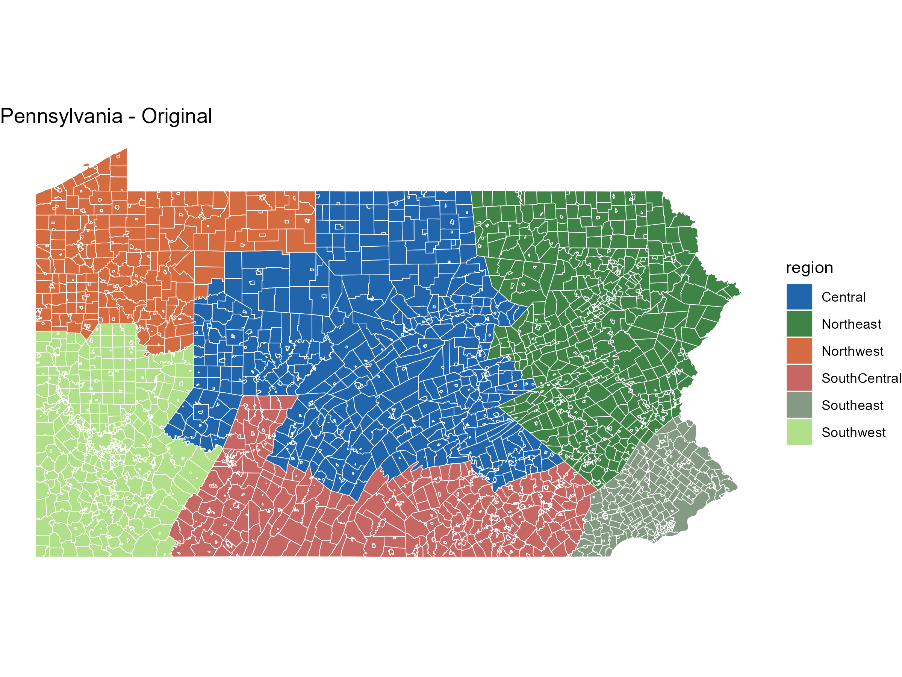
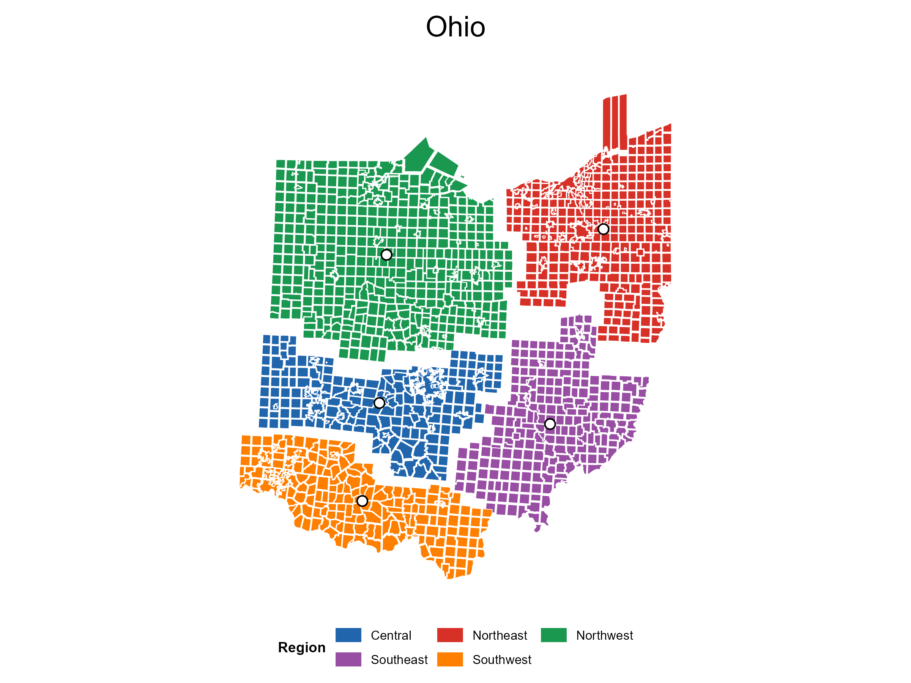
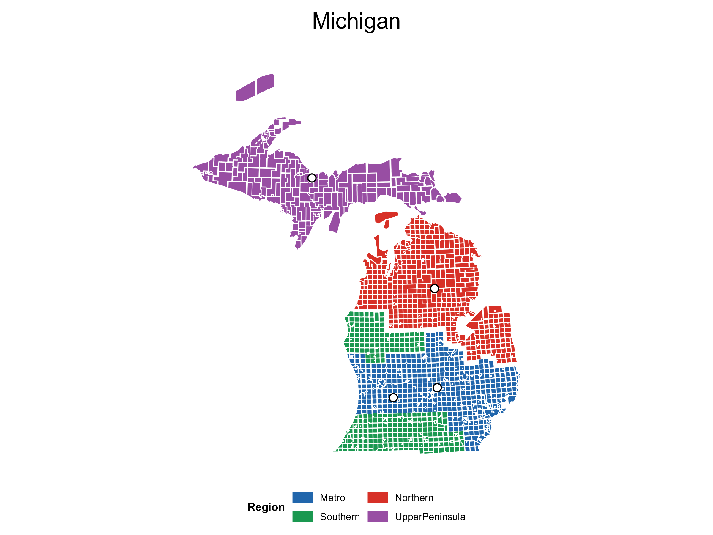
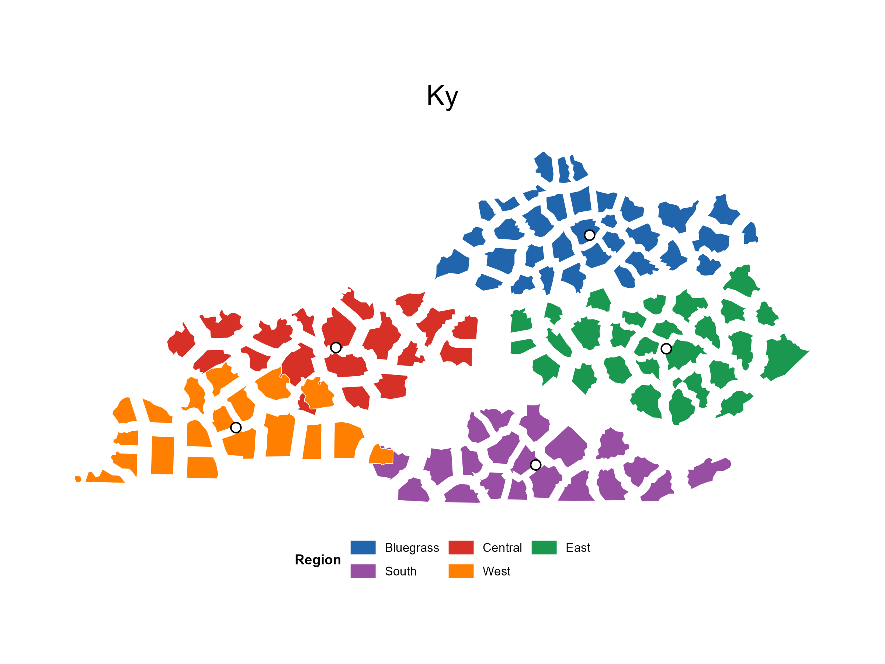
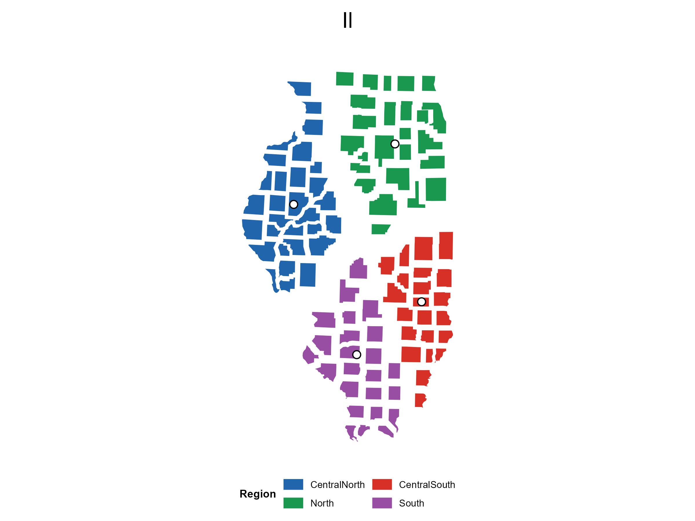
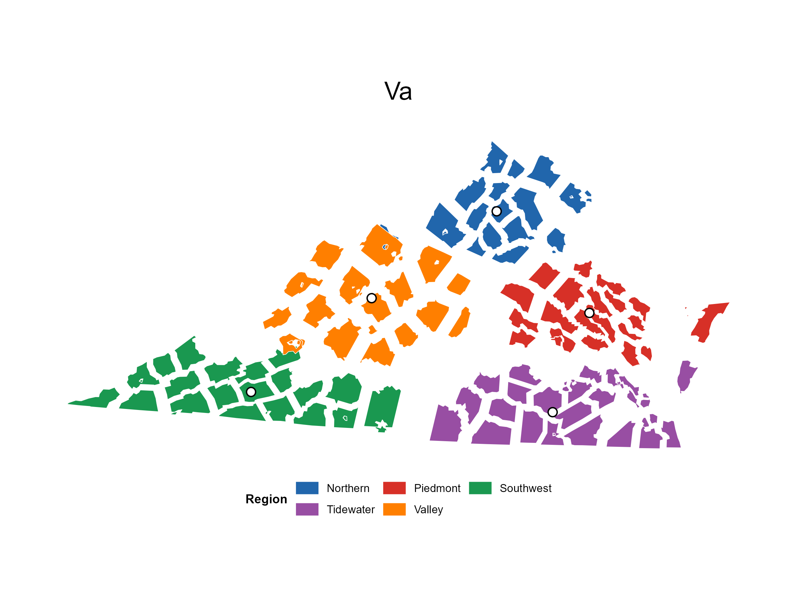
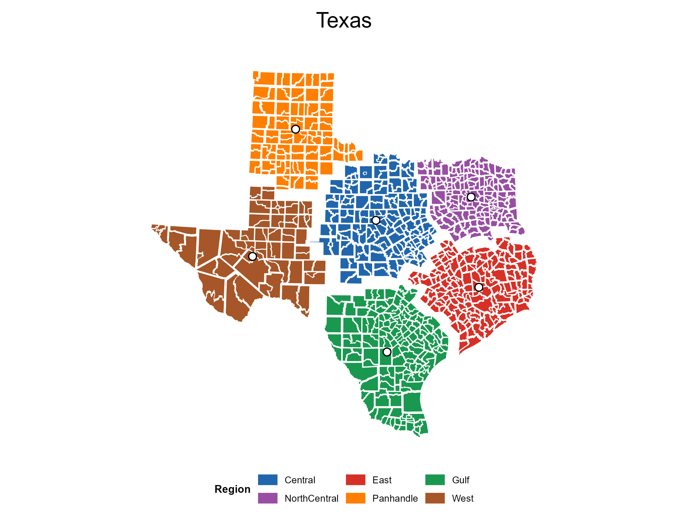
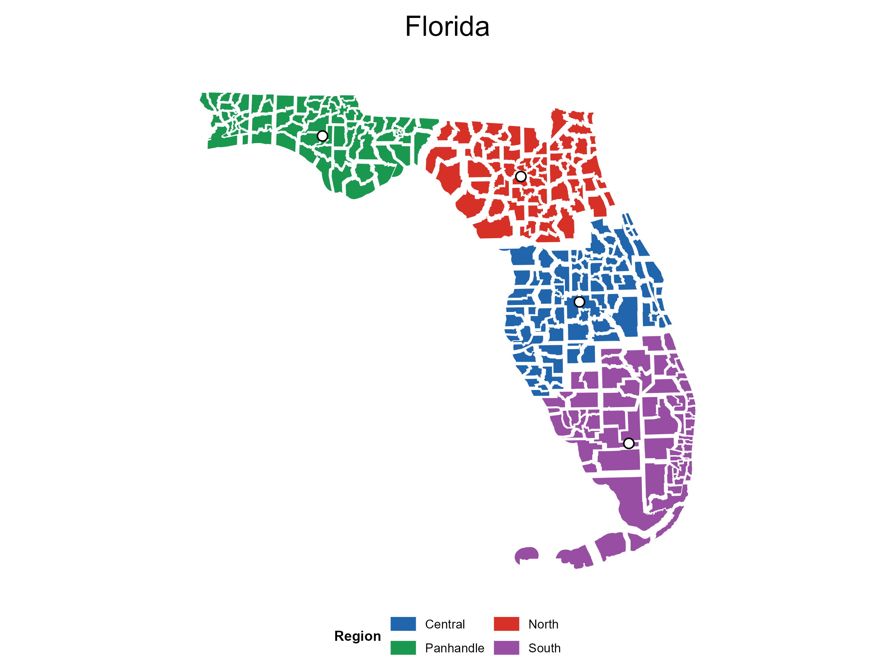

## How to Read the Outputs

| Output type | Used for | Manual offsets? | Used in quantitative metrics? |
|----|----|----|----|
| Original geographic layout | Baseline | No | Yes |
| Formula-derived exploded layout | Validation | No | Yes |
| Display-offset layout | Publication figures / web gallery | Yes, documented | Only if explicitly stated |

## New Jersey

Formula-derived and display-offset layouts for the calibration case. The
display offsets are documented separately from the analytical validation
output.

Formula-derived exploded layout

Display-offset layout

[Display offset
CSV](https://prigasg.github.io/explodemap/map-gallery/assets/tables/nj_drag_offsets_used.csv)

## Pennsylvania

The Pennsylvania case includes the original geography, the
formula-derived validation output, the display-offset figure, and a
displacement-vector diagnostic showing how municipal units are pulled
apart.

Original geography

Formula-derived exploded layout

Display-offset layout

Displacement vectors

[Display offset
CSV](https://prigasg.github.io/explodemap/map-gallery/assets/tables/pa_drag_offsets_used.csv)
[Validation metrics
CSV](https://prigasg.github.io/explodemap/map-gallery/assets/tables/cross_state_metrics.csv)

## Extended U.S. States

Additional state examples show where the same analytical parameter
derivation remains stable and where documented display offsets improve
publication readability.

Ohio display-offset layout

Michigan display-offset layout

Kentucky display-offset layout

Illinois display-offset layout

North Dakota display-offset layout

North Carolina display-offset layout

Virginia display-offset layout

Texas display-offset layout

Florida display-offset layout

### Supplemental County-Level Gallery Layouts

These additional layouts use county-level units rather than
county-subdivision units. They are included as visual demonstrations of
the same display-offset workflow, not as tightness-ratio calibration
cases.

Tennessee display-offset layout

Georgia display-offset layout

Minnesota display-offset layout

California display-offset layout

Colorado display-offset layout

[Tennessee offset
CSV](https://prigasg.github.io/explodemap/map-gallery/assets/tables/tn_drag_offsets_used.csv)
[Georgia offset
CSV](https://prigasg.github.io/explodemap/map-gallery/assets/tables/ga_drag_offsets_used.csv)
[Minnesota offset
CSV](https://prigasg.github.io/explodemap/map-gallery/assets/tables/mn_drag_offsets_used.csv)
[California offset
CSV](https://prigasg.github.io/explodemap/map-gallery/assets/tables/ca_drag_offsets_used.csv)
[Colorado offset
CSV](https://prigasg.github.io/explodemap/map-gallery/assets/tables/co_drag_offsets_used.csv)

### Formula-Derived Validation Parameters

| Case | alpha_r (km) | alpha_l (km) | Units | Manual offsets in metrics? | Offset CSV |
|----|----|----|----|----|----|
| New Jersey | 6.8 | 10 | 564 | No | [CSV](https://prigasg.github.io/explodemap/map-gallery/assets/tables/nj_drag_offsets_used.csv) |
| Pennsylvania | 20.2 | 12.4 | 2,572 | No | [CSV](https://prigasg.github.io/explodemap/map-gallery/assets/tables/pa_drag_offsets_used.csv) |
| Ohio | 23.6 | 17.5 | 1,602 | No | [CSV](https://prigasg.github.io/explodemap/map-gallery/assets/tables/oh_drag_offsets_used.csv) |
| Michigan | 23 | 22.2 | 1,540 | No | [CSV](https://prigasg.github.io/explodemap/map-gallery/assets/tables/mi_drag_offsets_used.csv) |
| Kentucky | 40.7 | 30.7 | 493 | No | [CSV](https://prigasg.github.io/explodemap/map-gallery/assets/tables/ky_drag_offsets_used.csv) |
| Illinois | 23.1 | 19.6 | 1,694 | No | [CSV](https://prigasg.github.io/explodemap/map-gallery/assets/tables/il_drag_offsets_used.csv) |
| North Dakota | 18.8 | 18.2 | 1,761 | No | [CSV](https://prigasg.github.io/explodemap/map-gallery/assets/tables/nd_drag_offsets_used.csv) |
| North Carolina | 20.3 | 23.1 | 1,041 | No | [CSV](https://prigasg.github.io/explodemap/map-gallery/assets/tables/nc_drag_offsets_used.csv) |
| Virginia | 36.9 | 30.9 | 582 | No | [CSV](https://prigasg.github.io/explodemap/map-gallery/assets/tables/va_drag_offsets_used.csv) |
| Texas | 79 | 39.7 | 862 | No | [CSV](https://prigasg.github.io/explodemap/map-gallery/assets/tables/tx_drag_offsets_used.csv) |
| Florida | 47.7 | 43.6 | 316 | No | [CSV](https://prigasg.github.io/explodemap/map-gallery/assets/tables/fl_drag_offsets_used.csv) |

## Canada/Germany

Canada and Germany illustrate multi-region transfer outside the main
U.S. municipal calibration set. Canada is included in the quantitative
table; Germany is included as a display and stress-test example.

Canada display-offset layout

Germany display-offset layout

[Canada offset
CSV](https://prigasg.github.io/explodemap/map-gallery/assets/tables/canada_drag_offsets_used.csv)
[Germany offset
CSV](https://prigasg.github.io/explodemap/map-gallery/assets/tables/germany_drag_offsets_used.csv)

## HHS National Grouped Layout

The HHS example uses numbered region labels, with region membership
defined in the manuscript table. The second figure documents the
display-offset movement used to clean up the final publication layout.

Final HHS grouped layout

Documented display offsets

[HHS offset
CSV](https://prigasg.github.io/explodemap/map-gallery/assets/tables/hhs_drag_offsets_used.csv)

## Download Data/Code

The publication figures are generated from the package source, paper
scripts, and documented offset tables. The repository contains the
regeneration scripts under `paper/scripts`; this page mirrors the
figures and small CSV outputs needed to audit the display-offset
layouts.

[Paper
scripts](https://github.com/PrigasG/explodemap/tree/master/paper/scripts)
[Cross-state metrics
CSV](https://prigasg.github.io/explodemap/map-gallery/assets/tables/cross_state_metrics.csv)
[Rendered-layout index
CSV](https://prigasg.github.io/explodemap/map-gallery/assets/tables/dragged_layout_render_index.csv)
[Repository](https://github.com/PrigasG/explodemap)
